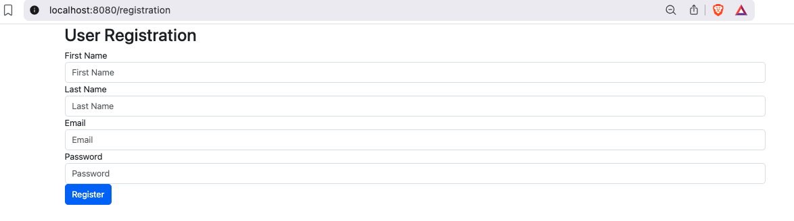
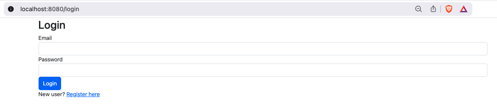
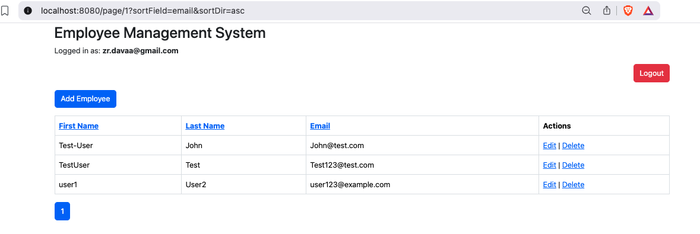
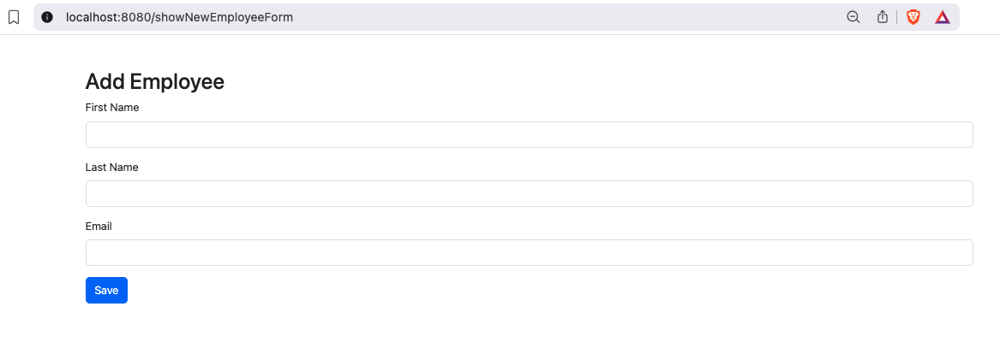

#  Employee Management System (Spring Boot + Thymeleaf + MySQL + Spring Security)

A full-stack Employee Management System built using **Spring Boot**, **Spring Data JPA**, **Spring Security**, **Thymeleaf**, and **MySQL** with login/registration functionality, pagination, sorting, and role-based access control.

---

##  Features

-  User Registration & Login with Spring Security
-  Employee CRUD (Create, Read, Update, Delete)
-  Pagination and Sorting
-  Thymeleaf templating
-  BCrypt password encoding
-  DAO Authentication Provider
-  MySQL database integration

---

##  Technologies Used

- Java 17
- Spring Boot 3+
- Spring Security
- Spring Data JPA
- Thymeleaf
- MySQL 8+
- Maven
- Bootstrap 5

---

##  Project Structure

```text
src
├── controller
│   ├── EmployeeController
│   ├── UserController
│   └── UserRegistrationController
├── dto
│   └── UserRegistrationDto.java
├── model
│   ├── Employee.java
│   ├── User.java
│   └── Role.java
├── repository
│   ├── EmployeeRepository.java
│   ├── UserRepository.java
│   └── RoleRepository.java
├── service
│   ├── EmployeeService.java
│   ├── UserService.java
│   └── UserServiceImpl.java
└── config
    └── SecurityConfiguration.java
```

---

##  Setup Instructions

1. **Clone the repository**  
   ```bash
   git clone https://github.com/Davaakhatan/employee-app.git
   cd employee-management-system
   ```

2. **Configure `application.properties`**  
   Update with your DB credentials:
   ```properties
   spring.datasource.url=jdbc:mysql://localhost:3306/employee_db
   spring.datasource.username=root
   spring.datasource.password=yourpassword
   spring.jpa.hibernate.ddl-auto=update
   ```

3. **Run the project**  
   ```bash
   ./mvnw spring-boot:run
   ```
   Navigate to:  
   - 📝 `http://localhost:8080/login` — Login  
   - ➕ `http://localhost:8080/registration` — Register new user  
   - 📋 `http://localhost:8080/` — View Employees (after login)

---

##  Issues Faced & How We Solved Them

| Issue | Cause | Solution |
|------|-------|----------|
| **Whitelabel Error at root `/`** | Spring couldn’t find the template for the default path | Added a controller to redirect to `/page/1` or mapped it manually |
| **Duplicate controller mappings** | `UserController` and `UserRegistrationController` both mapped to `/registration` | Removed one controller to avoid ambiguity |
| **No logout button visible** | Button was added inside conditional `<th:if>` but wasn't styled or tested properly | Ensured logout form is placed in header and styled with Bootstrap |
| **Users table empty** | Wrong database (`employee_db`) was assumed | Switched to `library_db` where data was actually being written |
| **Error creating bean** | Conflicting Spring MVC mappings | Cleaned up overlapping controller mappings |

---


## Screenshots

### 1. Registration Page


### 2. Login Page


### 3. Employee List Dashboard


### 4. Add Employee Form


##  Improvements

- Role-based access: Admin vs User
- Better form validation
- REST API version
- Dockerize app
- Frontend with React or Angular (optional)

---

## 👤 Author

**Davaakhatan Zorigtbaatar**  
_Master’s in Software Engineering @ Gannon University_

---

## 📄 License

This project is licensed under the MIT License.
